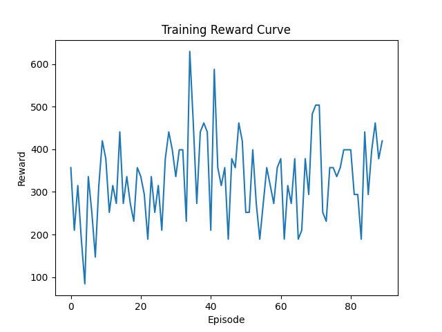
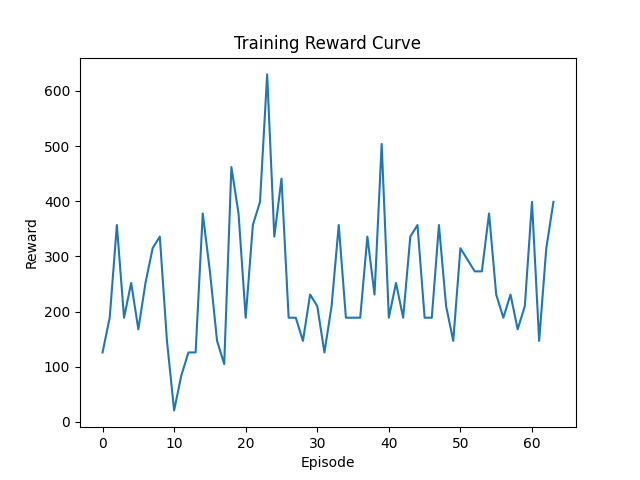

# Results

PPO agent trained for 10_000 timesteps, with mostly default hyperparameters.

**training output:**
```
Starting main.py
Setting up environment...
A.L.E: Arcade Learning Environment (version 0.11.2+ecc1138)
[Powered by Stella]
Setting up model...
Using cpu device
Wrapping the env in a DummyVecEnv.
Wrapping the env in a VecTransposeImage.
Training model...
Logging to ./logs/PPO_assault_tensorboard/PPO_1
...
Saving model...
Printing results...
Episode rewards: [231.0, 189.0, 168.0, 189.0, 231.0, 357.0, 210.0, 189.0, 189.0, 231.0, 189.0, 378.0, 63.0, 147.0, 189.0, 294.0, 336.0, 168.0, 210.0]
Mean reward: 218.8421052631579
Number of episodes: 19
Plotting results...
```
and then we get a barchart of rewards overtime:


We got a mean reward of ~219.

The results are not very good, seems like our PPO agent is stagnating

## PPO Agent with Optuna tuning
Tune parameters for 10_000 timesteps.

Train agent with optimized hyperparameters for 100_000 timesteps.

**Tuned Parameters:**

```
n_steps = trial.suggest_categorical("n_steps", [128, 256, 512, 1024])
gamma = trial.suggest_float("gamma", 0.9, 0.9999)
learning_rate = trial.suggest_float("learning_rate", 1e-5, 1e-3, log=True)
ent_coef = trial.suggest_float("ent_coef", 0.0, 0.01)
gae_lambda = trial.suggest_float("gae_lambda", 0.8, 1.0)
clip_range = trial.suggest_float("clip_range", 0.1, 0.4)
```
**Study output:**
```
Best hyperparameters: {'n_steps': 512, 'gamma': 0.9452010144281489, 'learning_rate': 1.4089525245412878e-05, 'ent_coef': 0.007888304360395778, 'gae_lambda': 0.8663251256623673, 'clip_range': 0.12460412239772464}
```
### PPO Agent results with tuned hyperparameters:
**Output:**
```
Episode rewards: [357.0, 210.0, 315.0, 189.0, 84.0, 336.0, 252.0, 147.0, 315.0, 420.0, 378.0, 252.0, 315.0, 273.0, 441.0, 273.0, 336.0, 273.0, 231.0, 357.0, 336.0, 294.0, 189.0, 336.0, 252.0, 315.0, 210.0, 378.0, 441.0, 399.0, 336.0, 399.0, 399.0, 231.0, 630.0, 462.0, 273.0, 441.0, 462.0, 441.0, 210.0, 588.0, 357.0, 315.0, 357.0, 189.0, 378.0, 357.0, 462.0, 420.0, 252.0, 252.0, 399.0, 273.0, 189.0, 273.0, 357.0, 315.0, 273.0, 357.0, 378.0, 189.0, 315.0, 273.0, 378.0, 189.0, 210.0, 378.0, 294.0, 483.0, 504.0, 504.0, 252.0, 231.0, 357.0, 357.0, 336.0, 357.0, 399.0, 399.0, 399.0, 294.0, 294.0, 189.0, 441.0, 294.0, 399.0, 462.0, 378.0, 420.0]
Mean reward: 332.26666666666665
Number of episodes: 90
```

Barchart of rewards per episode:



So with a mean reward of 332 over 90 episodes; the progress is very slow but definetly there. Not the most effienct agent to solve this game.

Summary: 332.26 / 218.84 = 1.518, so with optimized hyperparameters — we increased score by roughly 51.8%. 

## DQN Agent

### Non tuned agent
**Output:**
```
Episode rewards: [168.0, 357.0, 147.0, 210.0, 189.0, 336.0, 336.0, 210.0, 252.0, 273.0, 336.0, 252.0]
Mean reward: 255.5
Number of episodes: 12
```
### Optuna tuning

Tune parameters for 10_000 timesteps.

Train agent with optimized hyperparameters for 50_000 timesteps.

**Tuned Parameters:**
```
learning_rate = trial.suggest_loguniform("learning_rate", 1e-5, 1e-3)
gamma = trial.suggest_uniform("gamma", 0.90, 0.999)
exploration_fraction = trial.suggest_uniform("exploration_fraction", 0.1, 0.4)
```

**Output:**
```
Best hyperparameters: {'learning_rate': 5.565274592749785e-05, 'gamma': 0.9865466308059884, 'exploration_fraction': 0.11351432355687767}
```
```
Episode rewards: [126.0, 189.0, 357.0, 189.0, 252.0, 168.0, 252.0, 315.0, 336.0, 147.0, 21.0, 84.0, 126.0, 126.0, 378.0, 273.0, 147.0, 105.0, 462.0, 378.0, 189.0, 357.0, 399.0, 630.0, 336.0, 441.0, 189.0, 189.0, 147.0, 231.0, 210.0, 126.0, 210.0, 357.0, 189.0, 189.0, 189.0, 336.0, 231.0, 504.0, 189.0, 252.0, 189.0, 336.0, 357.0, 189.0, 189.0, 357.0, 210.0, 147.0, 315.0, 294.0, 273.0, 273.0, 378.0, 231.0, 189.0, 231.0, 168.0, 210.0, 399.0, 147.0, 315.0, 399.0]
Mean reward: 254.953125
Number of episodes: 64
```

Barchart of rewards per episode:


Summary: 254.95 / 255.5 = 0.997, which means the agent did not improve with optuna optimization and instead stayed stagnant. DQN does not work well with visual based problems. The model couldn't catch the complex patterns probably.

# Extra
The CnnPolicy (Convolutional Neural Network policy) is designed to process visual inputs.
Since Atari Assault is visual, we use CnnPolicy for our Agents.

Buffer_size and learning_starts fixed to a low value to save memory, since DQN is very fast to eat up huge amounts of memory in such a game (also why its probably not that good).

# Sources

Stable-baselines3 example: https://stable-baselines3.readthedocs.io/en/master/guide/examples.html
ALE docs: https://ale.farama.org/getting-started/
Atari assault environment: https://ale.farama.org/environments/assault/
YouTube Ale env tutorial: https://www.youtube.com/watch?v=Y7z30KjLR2M