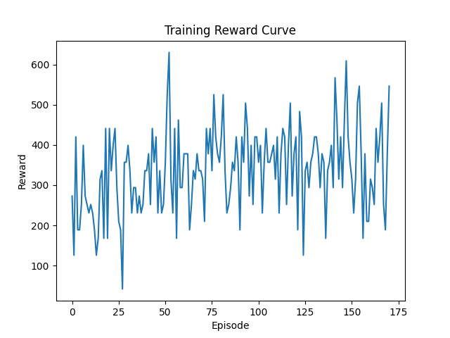
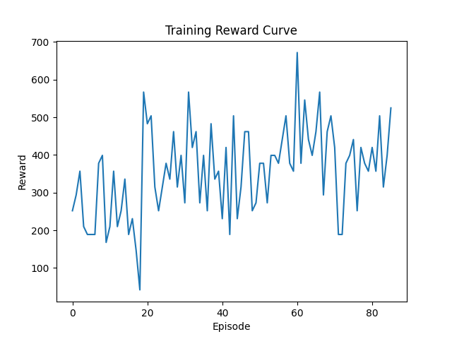

# Results

PPO agent trained for 10_000 timesteps, with mostly default hyperparameters.

**output:**
```
Starting main.py
Setting up environment...
A.L.E: Arcade Learning Environment (version 0.11.2+ecc1138)
[Powered by Stella]
Setting up model...
Using cpu device
Wrapping the env in a DummyVecEnv.
Wrapping the env in a VecTransposeImage.
Training model...
Logging to ./logs/PPO_assault_tensorboard/PPO_1
...
Saving model...
Printing results...
Episode rewards: [231.0, 189.0, 168.0, 189.0, 231.0, 357.0, 210.0, 189.0, 189.0, 231.0, 189.0, 378.0, 63.0, 147.0, 189.0, 294.0, 336.0, 168.0, 210.0]
Mean reward: 218.8421052631579
Number of episodes: 19
Plotting results...
```
and then we get a barchart of rewards overtime:


We got a mean reward of ~219.

The results are not very good, seems like our PPO agent is stagnating

## PPO Agent with Optuna tuning
Tune parameters for 10_000 timesteps.

Train agent with optimized hyperparameters for 100_000 timesteps.

**Tuned Parameters:**

```
n_steps = trial.suggest_categorical("n_steps", [128, 256, 512, 1024])
gamma = trial.suggest_float("gamma", 0.9, 0.9999)
learning_rate = trial.suggest_float("learning_rate", 1e-5, 1e-3, log=True)
ent_coef = trial.suggest_float("ent_coef", 0.0, 0.01)
gae_lambda = trial.suggest_float("gae_lambda", 0.8, 1.0)
clip_range = trial.suggest_float("clip_range", 0.1, 0.4)
```
**Study output:**
```
Best hyperparameters: {'n_steps': 512, 'gamma': 0.9452010144281489, 'learning_rate': 1.4089525245412878e-05, 'ent_coef': 0.007888304360395778, 'gae_lambda': 0.8663251256623673, 'clip_range': 0.12460412239772464}
```
### PPO Agent results with tuned hyperparameters:
**Output:**
```
Episode rewards: [357.0, 210.0, 315.0, 189.0, 84.0, 336.0, 252.0, 147.0, 315.0, 420.0, 378.0, 252.0, 315.0, 273.0, 441.0, 273.0, 336.0, 273.0, 231.0, 357.0, 336.0, 294.0, 189.0, 336.0, 252.0, 315.0, 210.0, 378.0, 441.0, 399.0, 336.0, 399.0, 399.0, 231.0, 630.0, 462.0, 273.0, 441.0, 462.0, 441.0, 210.0, 588.0, 357.0, 315.0, 357.0, 189.0, 378.0, 357.0, 462.0, 420.0, 252.0, 252.0, 399.0, 273.0, 189.0, 273.0, 357.0, 315.0, 273.0, 357.0, 378.0, 189.0, 315.0, 273.0, 378.0, 189.0, 210.0, 378.0, 294.0, 483.0, 504.0, 504.0, 252.0, 231.0, 357.0, 357.0, 336.0, 357.0, 399.0, 399.0, 399.0, 294.0, 294.0, 189.0, 441.0, 294.0, 399.0, 462.0, 378.0, 420.0]
Mean reward: 332.26666666666665
Number of episodes: 90
```

Barchart of rewards per episode:


So with a mean reward of 332 over 90 episodes; the progress is very slow but definetly there. Not the most effienct agent to solve this game.

Summary: 332.26 / 218.84 = 1.518, so with optimized hyperparameters — we increased score by roughly 51.8%. 

## DQN Agent

### Non tuned agent
**Output:**
```
Episode rewards: [168.0, 357.0, 147.0, 210.0, 189.0, 336.0, 336.0, 210.0, 252.0, 273.0, 336.0, 252.0]
Mean reward: 255.5
Number of episodes: 12
```
### Optuna tuning

Tune parameters for 10_000 timesteps.

Train agent with optimized hyperparameters for 50_000 timesteps.

**Tuned Parameters:**
```
learning_rate = trial.suggest_loguniform("learning_rate", 1e-5, 1e-3)
gamma = trial.suggest_float("gamma", 0.90, 0.999)
exploration_fraction = trial.suggest_uniform("exploration_fraction", 0.1, 0.4)
```

**Output:**
```
Best hyperparameters: {'learning_rate': 5.565274592749785e-05, 'gamma': 0.9865466308059884, 'exploration_fraction': 0.11351432355687767}
```
```
Episode rewards: [126.0, 189.0, 357.0, 189.0, 252.0, 168.0, 252.0, 315.0, 336.0, 147.0, 21.0, 84.0, 126.0, 126.0, 378.0, 273.0, 147.0, 105.0, 462.0, 378.0, 189.0, 357.0, 399.0, 630.0, 336.0, 441.0, 189.0, 189.0, 147.0, 231.0, 210.0, 126.0, 210.0, 357.0, 189.0, 189.0, 189.0, 336.0, 231.0, 504.0, 189.0, 252.0, 189.0, 336.0, 357.0, 189.0, 189.0, 357.0, 210.0, 147.0, 315.0, 294.0, 273.0, 273.0, 378.0, 231.0, 189.0, 231.0, 168.0, 210.0, 399.0, 147.0, 315.0, 399.0]
Mean reward: 254.953125
Number of episodes: 64
```

Barchart of rewards per episode:


Summary: 254.95 / 255.5 = 0.997, which means the agent did not improve with optuna optimization and instead stayed stagnant. DQN does not work well with visual based problems. The model couldn't catch the complex patterns probably.

## QR-DQN Agent
QR-DQN is an improved version of DQN. 

Stable baselines3 - contrib:
```
Quantile Regression DQN (QR-DQN) builds on Deep Q-Network (DQN) and make use of quantile regression to explicitly model the distribution over returns, instead of predicting the mean return (DQN).

### Non tuned agent
**Output:**
```
Episode rewards: [147.0, 0.0, 0.0, 63.0, 0.0, 0.0, 21.0, 21.0, 21.0, 21.0, 63.0]
Total steps: 119300
Mean reward: 32.45454545454545
Number of episodes: 11
```
### Optuna tuning
```
**Tune parameters for 10_000 timesteps:**

Tuned Parameters:
```
learning_rate = trial.suggest_float("learning_rate", 1e-5, 1e-3, log=True) # better sample the log scale
gamma = trial.suggest_float("gamma", 0.90, 0.999)
batch_size = trial.suggest_categorical("batch_size", [32, 64, 128])
train_freq = trial.suggest_categorical("train_freq", [1, 4])
exploration_fraction = trial.suggest_float("exploration_fraction", 0.1, 0.5)
exploration_final_eps = trial.suggest_float("exploration_final_eps", 0.01, 0.1)
```

**Train agent with optimized hyperparameters for 50_000 timesteps:**

Output:
```
Episode rewards: [273.0, 126.0, 420.0, 189.0, 189.0, 252.0, 399.0, 273.0, 252.0, 231.0, 252.0, 231.0, 189.0, 126.0, 168.0, 315.0, 336.0, 168.0, 441.0, 168.0, 441.0, 336.0, 399.0, 441.0, 294.0, 210.0, 189.0, 42.0, 357.0, 357.0, 399.0, 336.0, 231.0, 294.0, 294.0, 231.0, 273.0, 231.0, 252.0, 336.0, 336.0, 378.0, 252.0, 441.0, 357.0, 420.0, 231.0, 336.0, 231.0, 252.0, 357.0, 525.0, 630.0, 315.0, 231.0, 441.0, 168.0, 
462.0, 294.0, 294.0, 378.0, 378.0, 378.0, 189.0, 252.0, 336.0, 315.0, 378.0, 336.0, 336.0, 315.0, 210.0, 441.0, 378.0, 441.0, 336.0, 525.0, 420.0, 378.0, 357.0, 420.0, 525.0, 336.0, 231.0, 252.0, 294.0, 357.0, 336.0, 420.0, 357.0, 189.0, 420.0, 357.0, 504.0, 441.0, 273.0, 399.0, 252.0, 420.0, 420.0, 357.0, 399.0, 231.0, 357.0, 441.0, 357.0, 357.0, 378.0, 399.0, 315.0, 420.0, 231.0, 378.0, 441.0, 420.0, 252.0, 399.0, 504.0, 273.0, 378.0, 420.0, 189.0, 483.0, 420.0, 126.0, 336.0, 357.0, 294.0, 357.0, 378.0, 420.0, 420.0, 378.0, 294.0, 378.0, 357.0, 168.0, 336.0, 357.0, 399.0, 294.0, 567.0, 462.0, 315.0, 420.0, 294.0, 462.0, 609.0, 420.0, 357.0, 315.0, 231.0, 315.0, 504.0, 546.0, 378.0, 168.0, 378.0, 210.0, 210.0, 315.0, 294.0, 252.0, 441.0, 357.0, 420.0, 504.0, 252.0, 189.0, 378.0, 546.0]
Mean reward: 337.5964912280702
Number of episodes: 171
```

Plotted results:


Second run (new 50_000 steps trained agent): 
```
Episode rewards: [252.0, 294.0, 357.0, 210.0, 189.0, 189.0, 189.0, 378.0, 399.0, 168.0, 210.0, 357.0, 210.0, 252.0, 336.0, 189.0, 231.0, 147.0, 42.0, 567.0, 483.0, 504.0, 315.0, 252.0, 315.0, 378.0, 336.0, 462.0, 315.0, 399.0, 273.0, 567.0, 420.0, 462.0, 273.0, 399.0, 252.0, 483.0, 336.0, 357.0, 231.0, 420.0, 189.0, 504.0, 231.0, 315.0, 462.0, 462.0, 252.0, 273.0, 378.0, 378.0, 273.0, 399.0, 399.0, 378.0, 441.0, 
504.0, 378.0, 357.0, 672.0, 378.0, 546.0, 441.0, 399.0, 462.0, 567.0, 294.0, 462.0, 504.0, 420.0, 189.0, 189.0, 378.0, 399.0, 441.0, 252.0, 420.0, 378.0, 357.0, 420.0, 357.0, 504.0, 315.0, 399.0, 525.0]      
Total steps: 201217
Mean reward: 356.2674418604651
Number of episodes: 86
```

Plotted results:


QR-DQN got about the same mean as my best PPO. But the PPO agent was trained for twice as long. So QR-DQN is definetly most efficent out of these three models.

# Summary
Atari Assault is a pixel based (visual) game with alot of stochasticity (randomness). These type of games require alot of exploration, hence its important we have that in our Optuna studies. For Atari Assault even 100_000 timesteps of training is little. 

#### Models
**PPO** can achieve surprisingly good rewards, but isn't able to learn long patterns. 

**DQN** is so slow and memory heavy that I didn't have time to properly even set benchmarks for it, but it could supposedly learn a little better than PPO after alot of training. 

**QR-DQN** is way more efficent than DQN and showed relativly stable growth. With more training it would definetly get best rewards out of these 3 models m(got same mean reward as PPO with half the training).

# Extra
The CnnPolicy (Convolutional Neural Network policy) is designed to process visual inputs.
Since Atari Assault is visual, we use CnnPolicy for our Agents.

DQN and QR-DQN: Buffer_size and/or learning_starts fixed to a low value to save memory, since DQN is very fast to eat up huge amounts of memory in such a game. 

terminal_on_life_loss=True; to treat life loss as episode termination. This made all rewards monitor rewards 0.

better sample the log scale, with log=true:
`learning_rate = trial.suggest_float("learning_rate", 1e-5, 1e-3, log=True)`

Vectorized environments would definetly speed up the training. 

# Sources

Stable-baselines3 example: https://stable-baselines3.readthedocs.io/en/master/guide/examples.html
QR-DQN: https://sb3-contrib.readthedocs.io/en/master/modules/qrdqn.html
ALE docs: https://ale.farama.org/getting-started/
Atari assault environment: https://ale.farama.org/environments/assault/
YouTube Ale env tutorial: https://www.youtube.com/watch?v=Y7z30KjLR2M