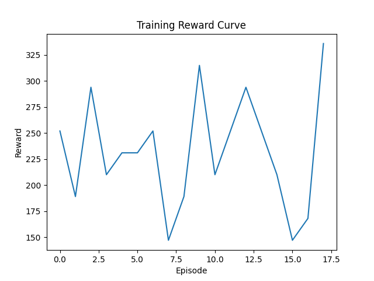

# Resultat

PPO agent tränad 10000 timesteps.

Tensorboard på Browser screenshot:
```
Starting main.py
Setting up environment...
A.L.E: Arcade Learning Environment (version 0.11.2+ecc1138)
[Powered by Stella]
Setting up model...
Using cpu device
Wrapping the env in a DummyVecEnv.
Wrapping the env in a VecTransposeImage.
Training model...
Logging to ./logs/PPO_assault_tensorboard/PPO_1
...
Saving model...
Printing results...
Episode rewards: [231.0, 189.0, 168.0, 189.0, 231.0, 357.0, 210.0, 189.0, 189.0, 231.0, 189.0, 378.0, 63.0, 147.0, 189.0, 294.0, 336.0, 168.0, 210.0]
Mean reward: 218.8421052631579
Number of episodes: 19
Plotting results...
```
and then we get a barchart of rewards overtime:


The results are not very good, seems like our PPO agent is stagnating.


# Annat

## Sources

Stable-baselines3 example: https://stable-baselines3.readthedocs.io/en/master/guide/examples.html
ALE docs: https://ale.farama.org/getting-started/
Atari assault environment: https://ale.farama.org/environments/assault/
YouTube Ale env tutorial: https://www.youtube.com/watch?v=Y7z30KjLR2M